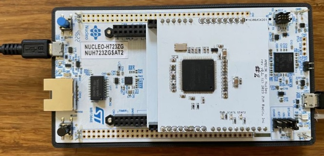
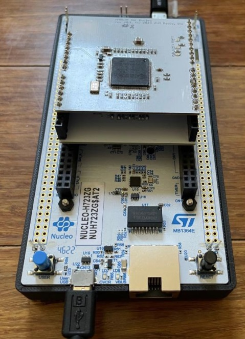

# MMDVM_transcoder_hw

This is the prototype PCB with AMBE3000R for Nucleo-H723 that has been used for the development of the MMDVM Transcoder and CrossMode projects.

The prototype board plugs into the ST Micro Nucleo-H723 evaluation board. 
https://www.st.com/en/evaluation-tools/nucleo-h723zg.html

The source code for the H723 transcoder firmware is available here:
https://github.com/g4klx/MMDVM-Transcoder

The source code for Windows/Linux cross mode controller is available here:
https://github.com/g4klx/MMDVM-CrossMode

The gerber (ZIP), schematic (PDF) and BOM (XLSX) files have been included in this repository.

This transcoder PCB is made available under the Creative Commons Attribution-NonCommercial-ShareAlike (CC BY-NC-SA) 4.0 license.
https://creativecommons.org/licenses/by-nc-sa/4.0/
